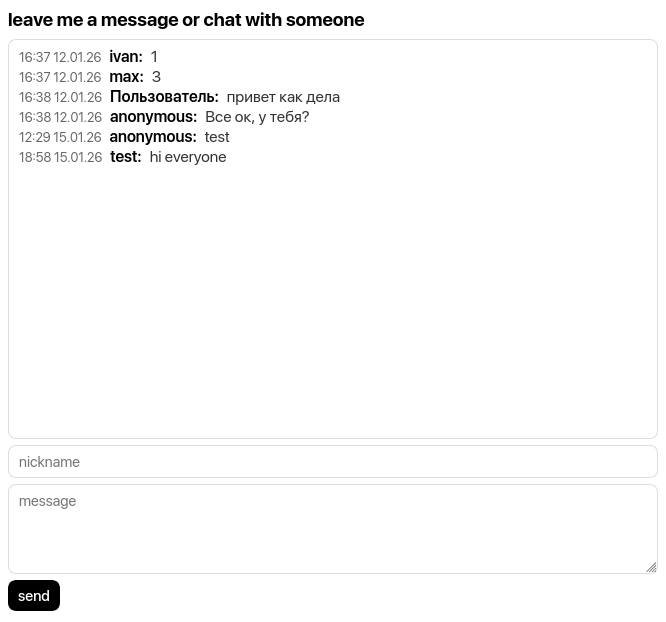

# dumbchat



A lightweight, embeddable real-time chat widget written in Go.

This project supports:

- Live messaging via WebSockets
- Admin message deletion
- Nickname filtering (prohibited words)
- Dark mode
- Embedding into existing Go projects or static sites (Hugo + Nginx)

# Tech Stack

- Go (net/http, html/template)
- SQLite (via `database/sql`)
- Gorilla WebSocket
- Chi router
- htmx

# Build & Run

## 1. Clone the repository

```bash
git clone https://github.com/acakp/dumbchat.git
cd dumbchat
```

## 2. Build the binary

```bash
GOOS=linux GOARCH=amd64 go build -o dumbchat
```

## 3. Run locally

```bash
./dumbchat
```

The server will start on the configured port (default: `:8888`).

---

# Configuration

Configuration is done via environment variables:

```env
CHAT_BASE_PATH='/chat'
ADMIN_PASSWORD_HASH='paste bcrypt hash of your password here'
BANNED_NICKNAMES='admin,owner'
```

# Embedding

1. Add these lines to the html page where you want to embed the chat:

Into the <head>:

```html
<link rel="stylesheet" href="/static/styles.css">
<script src="/static/htmx.js"></script>
```

Into the <body> (in hx-get you should specify your base path from `.env`):

```html
<div hx-get="/chat" hx-trigger="load" hx-swap="innerHTML">
</div>
```
